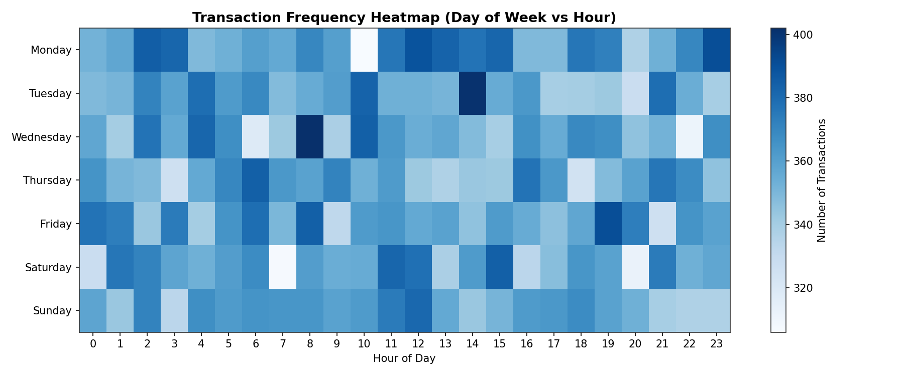

# 🏦 Banking Transaction Analysis & Fraud Detection

**Live demo:**  https://jiya17batra.github.io/Banking-Transaction-Analysis/

An end-to-end data analytics project: synthetic banking transaction data →
cleaning → SQL analytics → customer behavior analysis → rule-based fraud
detection → ML fraud classifier → interactive dashboard.



## Highlights
- 60,000+ transactions across 3,000 customers, 2 years of data
- Rule-based fraud engine: 6 weighted rules, 79.7% recall
- ML fraud model (Random Forest): **0.975 ROC-AUC**, 82% recall
- Interactive Streamlit dashboard with filters, KPIs, and drill-downs

## Project Pipeline
1. **Data generation** — synthetic transactions with realistic patterns + injected data-quality issues
2. **Cleaning & preprocessing** — deduplication, standardization, missing-value handling, outlier detection
3. **SQL database** — relational schema (`customers`, `transactions`, `suspicious_transactions`)
4. **EDA & customer behavior analysis** — spending trends, segmentation, category/location breakdowns
5. **Fraud detection** — rule-based engine + Random Forest classifier
6. **Dashboard** — this Streamlit app

The full pipeline (data generation, cleaning scripts, SQL schema/queries, and
model training code) is in the companion repo / `pipeline/` folder — see
[full project documentation](https://github.com/YOUR_USERNAME/YOUR_REPO) for details.

## Run Locally
```bash
pip install -r requirements.txt
streamlit run app.py
```

## Deploy for Free (Streamlit Community Cloud)
1. Create a new GitHub repo and push this folder's contents (`app.py`,
   `requirements.txt`, `data/`, `assets/`) to it.
2. Go to **[share.streamlit.io](https://share.streamlit.io)** and sign in with GitHub.
3. Click **"New app"** → select your repo/branch → set **Main file path** to `app.py`.
4. Click **Deploy**. Your app will be live at
   `https://<your-app-name>.streamlit.app` in a couple of minutes.
5. Copy that URL into your resume/LinkedIn/portfolio, and into the top of this README.

## Tech Stack
Python (Pandas, NumPy, Scikit-learn, Plotly) · SQL / MySQL · Streamlit

## Folder Contents
```
app.py              # Streamlit dashboard (entry point)
requirements.txt    # Python dependencies
data/               # Pre-processed transaction data + fraud predictions
assets/             # Static chart images used in the Overview tab
```
